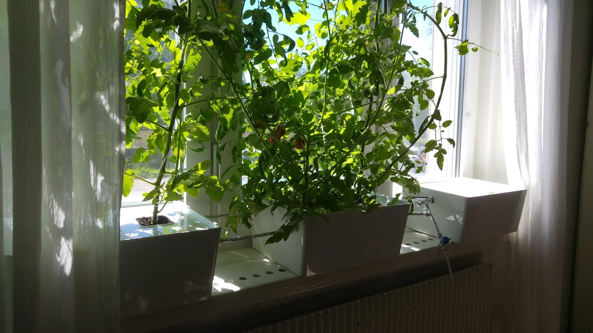

The development is currently in alpha, but you can of course try it out.

# Introduction
The goal of this repository is to contain all the information needed to
[get](#how-to-get), [build](#how-to-build) and [run](#how-to-run) an high
pressure aeroponics. The idea is to design a cheap modular system that anyone
can use at home for sustainable food production.

# Small and modular DIY kit
Using a small and modular DIY kit can be very useful for growing herbs or other
small plants you prefer. The parts cost around USD 57 (SEK 500) and to run the
basic kit in the window costs about USD 0.11 (SEK 1) per month. If you, like
me, live in Sweden and need some extra light during winter, you can use LEDs
which can cost you USD 1 (SEK 9) per month - a price example of using LEDs from
IKEA.

## How to get
Go to the [wiki](https://github.com/rhagman/sustainable-green-plants/wiki) and
look under the [small and modular DIY
kit](https://github.com/rhagman/sustainable-green-plants/wiki/Small-and-modular-DIY-kit)
section.

## How to build
Follow the [guide in google photos](https://goo.gl/photos/72PxL2RxAaFRTnkQA).
If you have any questions or need help, you can just comment in the album.

## How to run
In short: mix 10g of
[nutrients](https://github.com/rhagman/sustainable-green-plants/wiki/List-of-materials)
into 4L of water and add it to the vases. Then, you add about 4L of water a
week to the vase and once a month you instead add 4L of the same nutrient mix
as before. [Here](https://goo.gl/photos/Q2npofLhUkbP5R9r5) is an album that I
add pictures to as I'm using it.

# Large and modular DIY kit
Using a large and modular DIY kit can be very useful for growing most plants
that you prefer, this is what you should use for sustainable food production.

## How to get
Go to the [wiki](https://github.com/rhagman/sustainable-green-plants/wiki) and
look under the [large and modular DIY
kit](https://github.com/rhagman/sustainable-green-plants/wiki/Large-and-modular-DIY-kit)
section.

## How to build
Follow the [guide in google photos](https://goo.gl/photos/Ph61oP1ydN2B55Q58).
If you have any questions or need help, you can just comment in the album.

# Software instructions
* arduino_sketch - contains the arduino sketch file which you need to upload to
your arduino uno.

# Get involved
Join our [slack](https://sgplants.slack.com) by sending me a message and I'll
send you an invitation! There have been a lot of different components that have
been tested to make these DIY kits, you can find a [list of
materials](https://github.com/rhagman/sustainable-green-plants/wiki/List-of-materials)
for what has been tested. If you think something should be changed with the
kits, then get in contact with me and we can update the kits!

# License
MIT

# Sustainable Green Plants

[imgur](https://sgplants.imgur.com/) |
[facebook](https://www.facebook.com/sgplants/) |
[twitter](https://twitter.com/sg_plants) |
[blogger](https://sustainablegreenplants.blogspot.se) |
[tumblr](https://sustainablegreenplants.tumblr.com) |
[instagram](https://www.instagram.com/sustainablegreenplants/)
